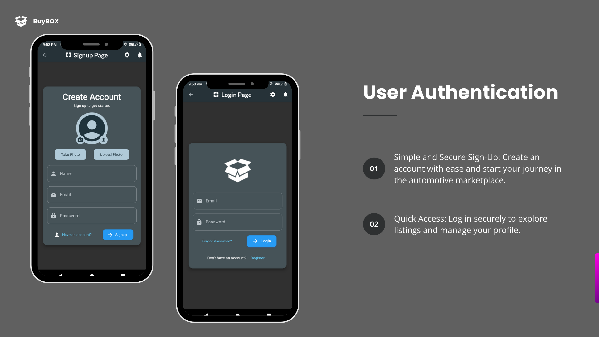
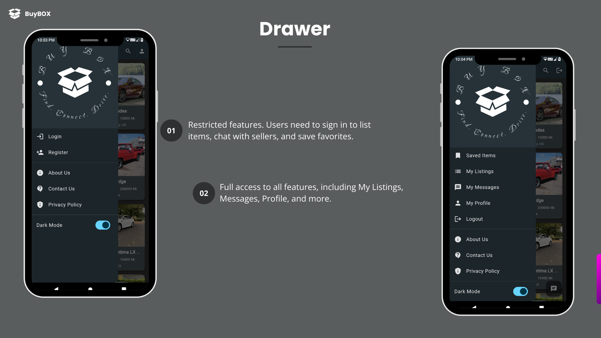
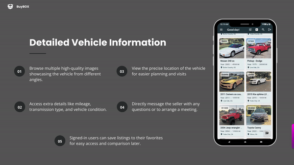
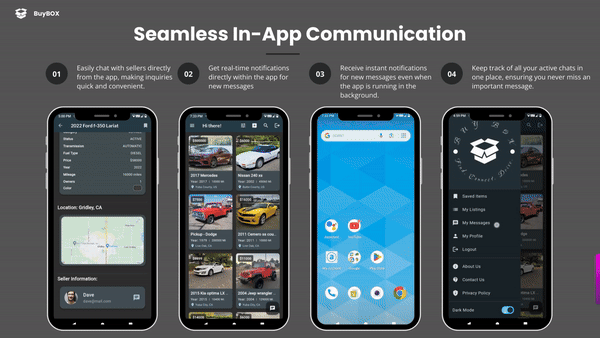

# BuyBox: Your One-Stop Automotive Marketplace

This app simplifies buying and selling vehicles. Connect with trusted sellers, browse listings, and manage your car-buying journey seamlessly.

## Table of Contents
* [About BuyBox](#about-the-project)
* [Tech Stack](#tech-stack)
* [Features](#features)
* [Getting Started](#getting-started)
    * [Prerequisites](#prerequisites)
    * [Installation](#installation)
* [Using BuyBox](#usage)
* [Roadmap](#roadmap)
* [Contributing](#contributing)
* [License](#license)
* [Contact](#contact)

## About BuyBox 

BuyBox is a comprehensive automotive marketplace app built with Flutter and Firebase. It connects buyers with sellers for a smooth car-buying experience. Users can easily post items for sale, search and filter listings by category (SUVs, sedans, trucks, motorcycles, boats, auto parts, etc.), and communicate directly with sellers. With robust functionality like map view, dark mode, and real-time chat, BuyBox aims to make the vehicle purchasing process smooth and efficient.

## Screenshots






[](https://www.youtube.com/watch?v=dQw4w9WgXcQ)






## Tech Stack
* **Flutter** (Client-side development)
* **Firebase** (Backend services, authentication)
* **Google Maps APIs** (Location services)

## Features
* **User-friendly Interface:** Easy navigation for a seamless experience.
* **Secure Login:** Safeguard your account with secure sign-up and login.
* **Sell Your Car:** List vehicles and auto parts with detailed descriptions and pictures.
* **Find Your Dream Car:** Search and filter listings by category, price, location, and more.
* **Favorite Listings:** Save cars you love for later reference.
* **Chat with Sellers:** Communicate directly with sellers through in-app chat.
* **Map View:** View item locations on a map.
* **Dark Mode:** Enjoy a comfortable viewing experience.

## Getting Started

Before you start using BuyBox, make sure you have:
* **Flutter:** Installed on your system.
* **Firebase Project:** Set up for backend services.

### Installation
1. **Clone the Repo:**
   ```bash
   git clone [https://github.com/yourusername/buybox.git](https://github.com/yourusername/buybox.git)
2. **Navigate to the Project Directory**:
   ```bash
   cd buybox
3. **Install Dependencies:**:
    ```bash
   flutter pub get
4. **Configure Firebase:**:
    ```bash
   Follow the Firebase setup instructions to add your google-services.json or GoogleService-Info.plist file to the project.
5. **Run the App:**:
    ```bash
   flutter run
## Roadmap

Future improvements and features planned for BuyBox include:
- **Enhanced Search Filters:** More advanced options for narrowing down search results.
- **User Reviews:** Allow users to leave reviews and ratings for sellers.
- **Payment Integration:** Implement secure payment options for transactions.
- **Vehicle History Reports:** Provide access to vehicle history reports for added transparency.
- **Additional Vehicle Categories:** Expand the app to include more vehicle types and auto parts.


## Usage

- **Sign Up / Log In**: Create a new account or log into an existing one to access all features.
- **Post Items**: List vehicles or auto parts with detailed descriptions and images.
- **Search and Filter**: Use the search and filtering options to find specific listings based on various criteria.
- **Favorites**: Manage and view your favorite listings.
- **Chat**: Communicate directly with sellers through the in-app chat feature.
- **Map View**: View item locations on a map.

## Contributing

Contributions are welcome!

## Contact

For any inquiries or feedback, please reach out to:
- **Email:** [ferozkhan@mail.com](mailto:ferozkhan@mail.com)
- **GitHub Issues:** [GitHub Issues](https://github.com/yourusername/buybox/issues)
- **LinkedIn:** [Your LinkedIn Profile](https://www.linkedin.com/in/yourprofile)

We welcome your feedback and contributions to make BuyBox even better!


   


        

    
