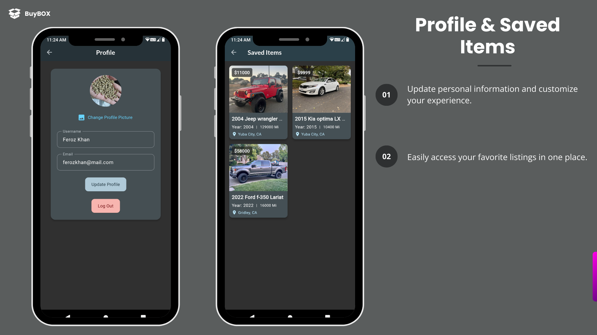
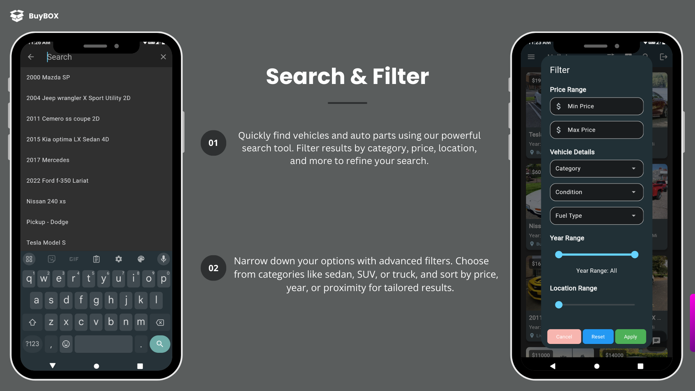

# BuyBox: Your One-Stop Automotive Marketplace

This app simplifies buying and selling vehicles. Connect with trusted sellers, browse listings, and manage your car-buying journey seamlessly.

## Table of Contents
* [About BuyBox](#about-the-project)
* [Tech Stack](#tech-stack)
* [Features](#features)
* [Getting Started](#getting-started)
    * [Prerequisites](#prerequisites)
    * [Installation](#installation)
* [Using BuyBox](#usage)
* [Roadmap](#roadmap)
* [Contributing](#contributing)
* [License](#license)
* [Contact](#contact)

## About BuyBox 

BuyBox is a comprehensive automotive marketplace app built with Flutter and Firebase. It connects buyers with sellers for a smooth car-buying experience. Users can easily post items for sale, search and filter listings by category (SUVs, sedans, trucks, motorcycles, boats, auto parts, etc.), and communicate directly with sellers. With robust functionality like map view, dark mode, and real-time chat, BuyBox aims to make the vehicle purchasing process smooth and efficient.

## Screenshots & Videos

## Screenshots & Videos

### 📸 Screenshots

1. **User Authentication Screens**
   - 
   - *Explore the seamless sign-up and login process of BuyBox, ensuring a smooth onboarding experience.*

2. **Drawer View**
   - 
   - *See the difference between signed-in and not signed-in views, giving users access to personalized features when signed in.*

3. **In-App Communication**
   - 
   - *Experience the in-app chat feature, enabling seamless communication between buyers and sellers.*

4. **Detailed Vehicle Information**
   - 
   - *Get a comprehensive look at vehicle details, including images, descriptions, and location maps.*

5. **Listing Management**
   - 
   - *Efficiently manage and list your vehicles or auto parts, with easy-to-use editing and deleting features.*

6. **Profile & Saved Items**
   - 
   - *Manage your profile and keep track of your favorite listings in one convenient place.*

7. **Search & Filter Features**
   - 
   - *Utilize advanced search and filter options to find the exact vehicles or parts you need.*

---

### 🎥 Videos

1. **Listing Management**
   - [Watch the Listing Management Video](https://youtu.be/o6xA20J1ThU)
   - *Learn how to effortlessly manage your listings, including adding, editing, and deleting.*

2. **Detail Screen**
   - [Watch the Detail Screen Video](https://youtu.be/55udmKIJ0CU)
   - *Explore the detailed view of vehicle listings, including high-resolution images and map integration.*

3. **Chat Feature**
   - [Watch the Chat Feature Video](https://youtu.be/wXaKX9Dgsuc)
   - *See the in-app chat feature in action, facilitating direct communication between buyers and sellers.*

4. **Search & Filter Feature**
   - [Watch the Search & Filter Feature Video](https://youtu.be/AVCtrwxUHog)
   - *Discover how the search and filter functionalities help you find specific listings quickly and efficiently.*


## Tech Stack
* **Flutter** (Client-side development)
* **Firebase** (Backend services, authentication)
* **Google Maps APIs** (Location services)

## Features
* **User-friendly Interface:** Easy navigation for a seamless experience.
* **Secure Login:** Safeguard your account with secure sign-up and login.
* **Sell Your Car:** List vehicles and auto parts with detailed descriptions and pictures.
* **Find Your Dream Car:** Search and filter listings by category, price, location, and more.
* **Favorite Listings:** Save cars you love for later reference.
* **Chat with Sellers:** Communicate directly with sellers through in-app chat.
* **Map View:** View item locations on a map.
* **Dark Mode:** Enjoy a comfortable viewing experience.

## Getting Started

Before you start using BuyBox, make sure you have:
* **Flutter:** Installed on your system.
* **Firebase Project:** Set up for backend services.

### Installation
1. **Clone the Repo:**
   Choose one of the following methods to clone the repository:

   - **Using SSH:**  
     ```bash
     git clone git@github.com:feroz-ali-khan/buybox.git
     ```

   - **Using HTTPS:**  
     ```bash
     git clone https://github.com/feroz-ali-khan/buybox.git
     ```
2. **Navigate to the Project Directory**:
   ```bash
   cd buybox
3. **Install Dependencies:**:
    ```bash
   flutter pub get
4. **Configure Firebase:**:
    ```bash
   Follow the Firebase setup instructions to add your google-services.json or GoogleService-Info.plist file to the project.
5. **Run the App:**:
    ```bash
   flutter run
## Roadmap

Future improvements and features planned for BuyBox include:
- **Enhanced Search Filters:** More advanced options for narrowing down search results.
- **User Reviews:** Allow users to leave reviews and ratings for sellers.
- **Payment Integration:** Implement secure payment options for transactions.
- **Vehicle History Reports:** Provide access to vehicle history reports for added transparency.
- **Additional Vehicle Categories:** Expand the app to include more vehicle types and auto parts.


## Usage

- **Sign Up / Log In**: Create a new account or log into an existing one to access all features.
- **Post Items**: List vehicles or auto parts with detailed descriptions and images.
- **Search and Filter**: Use the search and filtering options to find specific listings based on various criteria.
- **Favorites**: Manage and view your favorite listings.
- **Chat**: Communicate directly with sellers through the in-app chat feature.
- **Map View**: View item locations on a map.

## Contributing

Contributions are welcome!

## Contact

For any inquiries, feedback, or contributions, please reach out to:

- **Email:** [ferozkhan@mail.com](mailto:ferozalikhan666@gmail.com)  
  *Feel free to email me with any questions or feedback about BuyBox.*

- **GitHub Issues:** [BuyBox GitHub Issues](https://github.com/feroz-ali-khan/buybox/issues)  
  *Report bugs, request features, or ask for help directly on the GitHub issues page.*

- **LinkedIn:** [Feroz Khan](https://www.linkedin.com/in/feroz-khan-95a166318/)  
  *Connect with me on LinkedIn to stay updated on my projects or to discuss potential collaborations.*


We welcome your feedback and contributions to make BuyBox even better!


   


        

    
